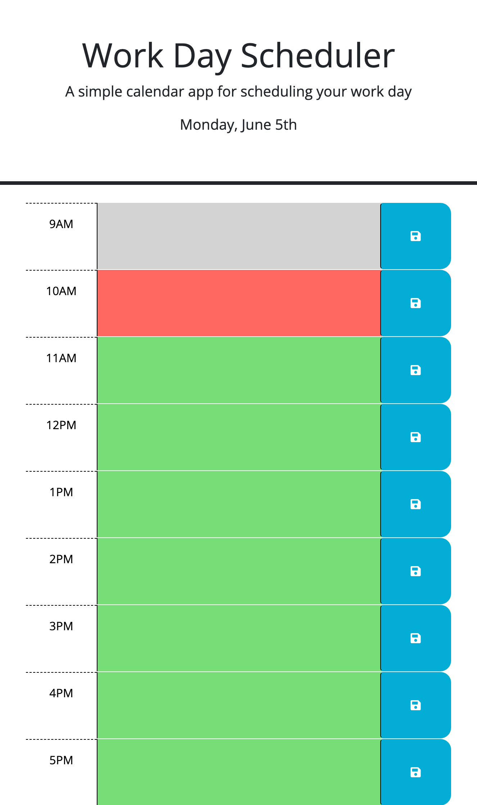

# My Portfolio

## Description

This webpage shows the timeblock for standard business hours. That is, from 9am to 5pm. On the webpage header, the current date is displayed. Every timeblock has a textarea that allows the user to enter an event, and a save button on the right side of the timeblock to save the event to the browser local storage. Through this project, I realised that id's and classes play an important role in DOM. This project benefitted imensely from collaboration through AskBCS.

## Installation

N/A

## Usage

To use this webpage, you can view the current date in the webpage header. You can also view the time in each in each timeblock and enter your event in the text area. To save your event to the browser local storage, click on the blue button to the right of the timeblock. The colour of the timeblock changes depending on if the timeblock is in the past (grey), present (red) and future (green).
The following image shows the web application's appearance and functionality:

## Credits

N/A

## License

N/A

## Tests

Here is the link to the webpage:
[My Portfolio](https://wdverse.github.io/My-Portfolio/)